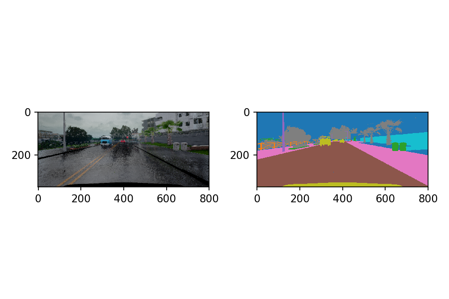

# Semantic Segmentation for Lyft Perception Challenge

## Aim of this project

This is my solution to [Lyft Perception Challenge](https://www.udacity.com/lyft-challenge) held by Udacity and Lyft in May of 2018.

The aim is to recognize the the pixels of cars and roads in the image generated by [Carla](http://carla.org/), an open-source simulator. 


## My Model

### Preprocessing and resizing





### Image augmentation

I implemented the following image augmentation:


### Model of semantic segmentation

I use Mobilenet(V1) as the encoder and FCN8 as the decoder.
The layers of the model is defined in ```mobilenetv1_fcn8_model()``` in [mobilenet_v1_fcn8.py](./mobilenet_v1_fcn8.py).
I use the pretrained model and the [layer definition](./mobilenet_v1.py) downloaded from the [official tensorflow github repo](https://github.com/tensorflow/models/tree/master/research/slim#pre-trained-models).


### Results


### My own reflection


## How to run the program


### Pretrained model:

Used the pretrained model ```mobilenet_v1_1.0_224``` downloaded from the github repo of Tensorflow.


### Train images

Preprocessing: Run ```simdata.py``` to generate the npy file from PNG files. This file converts the train data into two .npy files.

Training: Run ```main.py```.


### Test
Run '''submit_ans.py [video file name]'```. For example:

```
submit_ans.py ./Example/test_video.mp4

```

