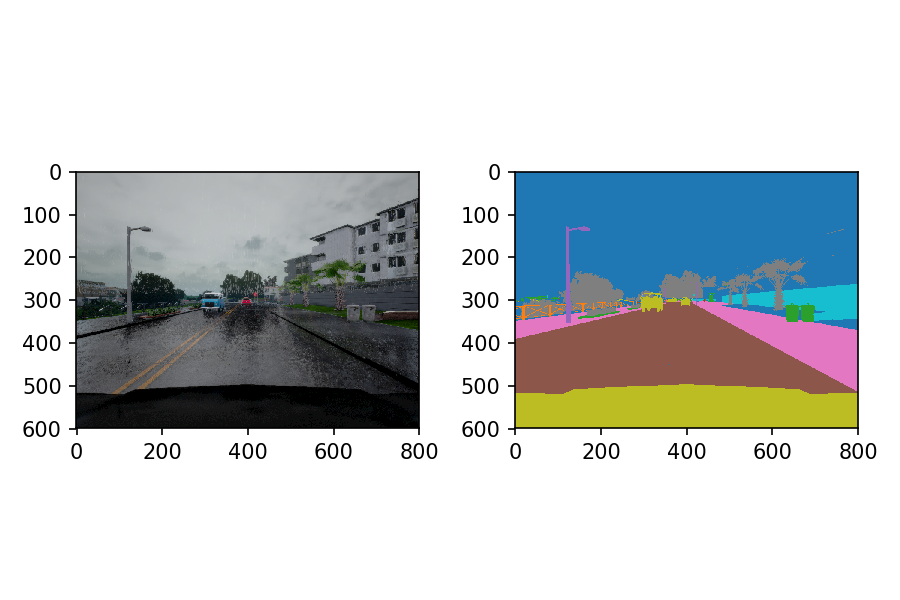

# Semantic Segmentation for Lyft Perception Challenge

## Aim of this project

This is my solution to [Lyft Perception Challenge](https://www.udacity.com/lyft-challenge) held by Udacity and Lyft in May of 2018.

The aim is to recognize the the pixels of cars and roads in the image generated by [Carla](http://carla.org/), an open-source simulator.




## My Model

### Model of semantic segmentation

I use the common encoder-decoder structure, in which Mobilenet(V1) as the encoder and FCN8 as the decoder.
The layers of the model is defined in ```mobilenetv1_fcn8_model()``` in [mobilenet_v1_fcn8.py](./mobilenet_v1_fcn8.py).
I use the pretrained model and the [layer definition](./mobilenet_v1.py) downloaded from the [official tensorflow github repo](https://github.com/tensorflow/models/tree/master/research/slim#pre-trained-models).

I choose Mobilenet mainly because of its speed. In the project, both the train and the test images are computer-generated graphics, which are simpler than real-life images. Therefore, a model structure with less variable should be sufficient.


### Crop and resize images

Our task to identify the pixels of road and vehicles. The top strip of the image mainly are sky and other road scenes, whereas the bottom strip are cardhood. We therefore can keep only the center part of the image to reduce the computational resources.

My implementation cut the top 170 pixels and the bottom 80 pixels. An example of the image is shown below:


The pretrained model requires the width and the height of the image to be the multiples of 224. I choose the resized image to be the shape of 448x896.

### Image selection and augmentation

Since the cross entropy loss is used as the metric during training, the model can be misguided by large difference of the number of pixels of the vehicles and the road.
To mitigate this problem, I only select the images with significant portion of vehicle pixels.

After than, the image was randomly left-right flipped and the color of the car is randomly distorted.


### Results

This model achieves the follwing score:

Car F score: 0.669   
Car Precision: 0.674   
Car Recall: 0.668   
Road F score: 0.976   
Road Precision: 0.980   
Road Recall: 0.960   
Averaged F score: 0.822

Processing rate: 13.698 FPS

This model runs really fast, even without using frozen graph or other optimization techniqes to evaluate images.
It performs reasonbly well on identifying the vehicles but its capability of identifying vehicles has room to improve.

## How to run the program


### Pretrained model:

Used the pretrained model ```mobilenet_v1_1.0_224``` downloaded from the github repo of Tensorflow.


### Train images

Preprocessing: Run ```simdata.py``` to generate the npy file from PNG files. This file converts the train data into two .npy files.

Training: Run ```main.py```.


### Test
Run '''submit_ans.py [video file name]'```. For example:

```
submit_ans.py ./Example/test_video.mp4

```
